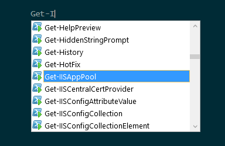
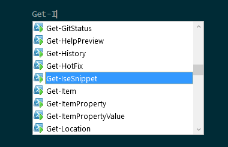

# Prune

Filter module auto-loading to only your choice of installed modules. This helps with performance and simplicity.

## Problem

I want to quickly tab-complete my input, `Get-I`, to the command that I want, `Get-Item`. However, because I have the `IISAdministration` module installed, I am offered a large number of commands that I do not regularly use:

## Solution

I import ModuleFilter and cut down the unwanted modules from my autoload setting. Now I have a much more tailored list of commands:

